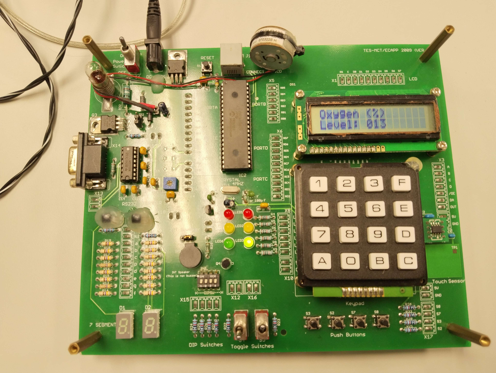
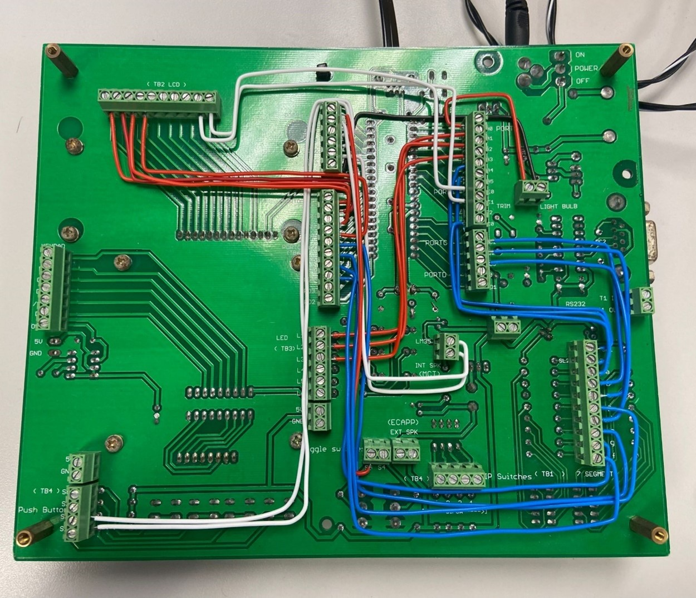
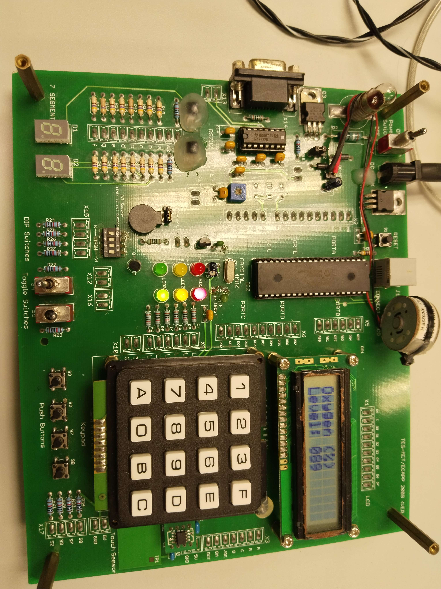
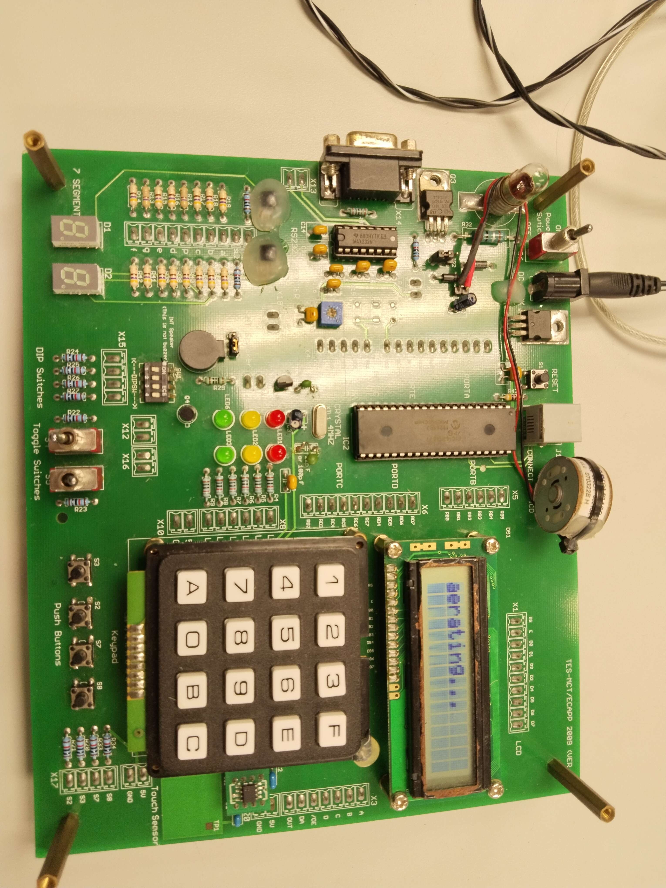
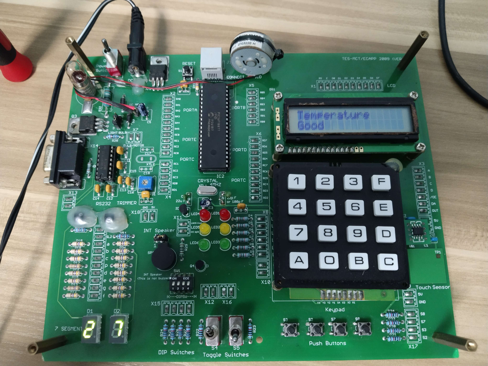

# AquaCulture in Singapore
Singapore hopes to produce 30% of its own food by 2030. This includes raising fish indoors. Indoor fish farming requires the temperature of the water in the containment tanks to be consistently regulated to ensure that the fish can thrive in their habitat and develop properly. 

For this group project, I have been tasked to develop a microcontroller system that can monitor and display water tank parameters such as temperature or others, regulate aeration or oxygenation automatically when oxygen level is detected to be low, notify the fish farmers via an audible tone, suitably display when the water conditions are not optimal as well as regulate treated water into the tanks, exchanging water to maintain its quality.

### Board operations
To simulate fish farming in Singapore, the target board will monitor the temperature, oxygen level, and water quality. The temperature will be displayed on a 7-segment display and the ideal temperature will be shown on an LCD. The oxygen level will be displayed on the LCD as a percentage. When the water quality is poor, an alert will sound and the motor will be activated to exchange the water. The farmer can manually aerate the water by pressing a button. All button presses will sound an alert to indicate that a change has been made.

### Software features
- Polling of input pins
- Interrupts
- Timer
- Analog-to-digital conversion

### Hardware components
- Onboard trimmer and/or external potentiometer
- LEDs, switches, push-buttons
- Seven-segment display
- 16 by 2 LCD
- Speaker
- Light-bulb, motor

### Personal Contributions
As part of a collaborative group project, I implemented the following features for the aquaculture system:
- Used the on-board trimmer to simulate LEDs that display water quality from green (good) to yellow (fair) to red (poor).
- Created a timer interrupt that automatically sounds a buzzer and resets the LEDs to green when the water quality is red (poor). This also alerts the farmers and triggers the motor to demonstrate water being exchanged.
- Created a pin interrupt for push buttons that allows the farmers to have an emergency reset button to manually exchange the water quality.

### Microcontroller front
 

### Microcontroller back
 

### Oxygen & water quality display
 

### Aerating
 

### Temperature
 
